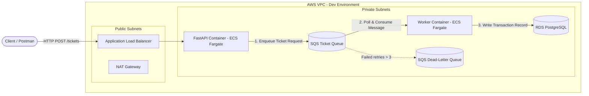

# Event-Driven AWS Backend Pipeline (SQS-ECS)

An asynchronous, event-driven ticket processing pipeline built with **FastAPI**, **Amazon SQS**, **AWS ECS Fargate**, and **Amazon RDS (PostgreSQL)**, fully provisioned via **Terraform** with **GitHub Actions CI/CD**.

---

## Architecture Overview



---

## Directory Structure

```
.
├── .github/
│   └── workflows/          # GitHub Actions CI/CD workflows
├── api/                    # FastAPI HTTP ingestion service
├── worker/                 # Python background worker service
├── terraform/
│   ├── modules/
│   │   ├── ecs/            # ECS Fargate & ALB module
│   │   ├── iam/            # Scoped IAM task/execution roles module
│   │   ├── networking/     # VPC, Subnets, NAT Gateway module
│   │   ├── rds/            # PostgreSQL RDS module
│   │   └── sqs/            # SQS & DLQ queue module
│   └── environments/
│       └── dev/            # Development environment deployment
├── COST.md                 # AWS Cost estimations & destroy instructions
└── README.md               # Project documentation
```

---

## Design Decisions

### Application Layer
*(To be populated in Phase 2)*

### Infrastructure & Security Layer
*(To be populated in Phase 3)*

### CI/CD & Operations Layer
*(To be populated in Phase 4)*

---

## Setup & Teardown

*(To be populated in Phase 3)*
