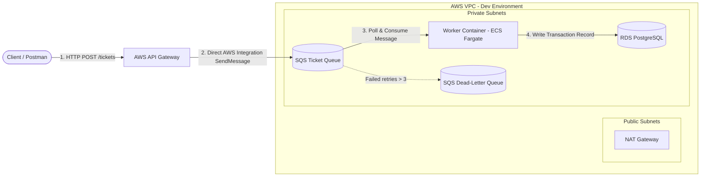

# Event-Driven AWS Backend Pipeline (SQS-ECS)

An asynchronous, event-driven ticket processing pipeline built with **AWS API Gateway**, **Amazon SQS**, **AWS ECS Fargate**, and **Amazon RDS (PostgreSQL)**, fully provisioned via **Terraform** with **GitHub Actions CI/CD**.

---

## Architecture Overview



---

## Directory Structure

```
.
├── .github/
│   └── workflows/          # GitHub Actions CI/CD workflows
├── worker/                 # Python background worker service (ECS Fargate)
│   ├── db.py               # Database connections and SQLAlchemy models
│   ├── main.py             # SQS polling loop and transaction handler
│   ├── Dockerfile          # Fargate container image specification
│   ├── requirements.txt    # Worker service dependencies
│   └── tests/              # Pytest unit tests using moto & SQLite
├── terraform/
│   ├── modules/
│   │   ├── apigateway/     # API Gateway direct SQS integration module
│   │   ├── ecs/            # ECS Fargate worker & scaling module
│   │   ├── iam/            # Scoped IAM task/execution roles module
│   │   ├── networking/     # VPC, Subnets, NAT Gateway module
│   │   ├── rds/            # PostgreSQL RDS module
│   │   └── sqs/            # SQS & DLQ queue module
│   └── environments/
│       └── dev/            # Development environment deployment
├── pytest.ini              # Pytest configuration
├── COST.md                 # AWS Cost estimations & destroy instructions
└── README.md               # Project documentation
```

---

## Design Decisions

### Application & Architecture Layer
- **Zero-Compute Ingestion (API Gateway -> SQS)**: Uses AWS Service Integration on API Gateway (`POST /tickets` -> `sqs:SendMessage`). Eliminates API container overhead, ensuring 100% serverless HTTP ingestion and zero cold starts.
- **Dedicated Python Consumer Microservice**: Runs continuously on AWS ECS Fargate, polling SQS via long polling (`WaitTimeSeconds=10`) to consume and process ticket transactions asynchronously.
- **SQLAlchemy ORM & Native UUIDv7**: Manages PostgreSQL database persistence. Uses `uuid7()` for primary key generation to ensure sequential, time-sortable database index performance.
- **At-Least-Once Delivery & Failure Handling**: SQS messages are only deleted (`sqs:delete_message`) **after** `db.commit()` succeeds. On failure, `db.rollback()` executes, skipping message deletion to allow SQS visibility timeout expiration and retry/DLQ routing.

### Infrastructure & Security Layer
- **Multi-AZ VPC Isolation**: Provisions 2 Public Subnets, 2 Private Application Subnets, and 2 Private Database Subnets across separate Availability Zones. NAT Gateway routes outbound traffic for private worker tasks.
- **Least-Privilege Security Groups**: No `0.0.0.0/0` ingress on internal components. RDS PostgreSQL accepts traffic *only* on port 5432 from the ECS Worker Security Group.
- **Least-Privilege IAM Roles**: API Gateway execution role is scoped strictly to `sqs:SendMessage`. ECS Worker task role is scoped strictly to SQS consumption (`sqs:ReceiveMessage`, `sqs:DeleteMessage`, `sqs:GetQueueAttributes`) and CloudWatch logging.
- **Auto-Scaling on Queue Depth**: CloudWatch metric alarm on `ApproximateNumberOfMessagesVisible > 10` triggers Application Auto Scaling step policies to dynamically scale worker container tasks.

### CI/CD & Operations Layer
*(To be populated in Phase 4)*

---

## Setup & Teardown

### Local Testing (Unit Tests)
```bash
python3 -m venv .venv
source .venv/bin/activate
pip install -r worker/requirements.txt
pytest
```

### Infrastructure Deployment (Terraform)
```bash
cd terraform/environments/dev
terraform init
terraform plan
terraform apply
```

### Infrastructure Teardown
To destroy all provisioned AWS resources and avoid unnecessary charges:
```bash
cd terraform/environments/dev
terraform destroy -auto-approve
```
